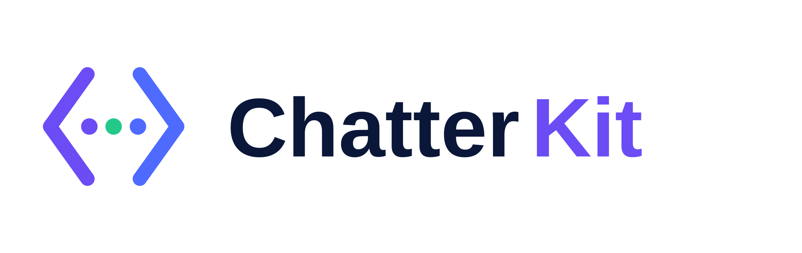

<p align="center">
  
</p>

<h1 align="center">Chatterkit</h1>

<p align="center">
  A reusable React TypeScript chatbot and chat widget library.
</p>

Chatterkit is a reusable **React TypeScript chatbot and chat widget library** for building embeddable support bots, FAQ assistants, customer-support widgets, and adapter-backed AI chat interfaces.

Use Chatterkit when you need a customizable React chatbot component for FAQ bots, AI support assistants, OpenAPI-compatible chat providers, or floating chat widgets in a Vite, Tailwind CSS, or TypeScript application.

Chatterkit currently supports:

- **FAQ mode** for predefined question/answer data.
- **Adapter mode** for developer-provided external services, including OpenAPI-compatible LLM backends.
- **Floating widgets** with optional draggable launchers and smart panel positioning.
- **Composable UI slots** for custom headers, message lists, FAQ buttons, state views, and composers.
- **Safe markdown chat bubbles** with GFM support, autolinks, and external-link protections.
- **Session helpers** for externally owned message history and browser storage persistence.
- **Opt-in no-preflight package CSS** so host applications control when Chatterkit styles are loaded without Tailwind global reset side effects.

The recommended stack is **React + TypeScript + Tailwind CSS + Vite + Vitest**.

## Live demo

Open the local-source demo in CodeSandbox:

```txt
https://codesandbox.io/p/sandbox/prp9gf
```

The sandbox runs the Vite dev server and loads `examples/codesandbox-demo.tsx`, which imports directly from this repository's local `src` folder:

```tsx
import { ChatBox, ChatBoxWidget } from '../src';
import '../src/style.css';
```

Use this local-source sandbox while iterating on unreleased changes. After publishing a new package version, examples can be switched to the public package import: `import { ChatBox, ChatBoxWidget } from 'chatterkit'`.

## Installation

```bash
npm install chatterkit
```

Import the component and package CSS explicitly:

```tsx
import { ChatBox, ChatBoxWidget } from 'chatterkit';
import 'chatterkit/style.css';
```

Chatterkit does not auto-load CSS from its JavaScript entry. Import `chatterkit/style.css` once in your app when you want the default theme. The package stylesheet is built without Tailwind preflight/global reset output, so importing it avoids applying Tailwind's page-level resets to host applications.

## Markdown chat bubbles

String message content renders as safe markdown in the built-in chat bubbles. FAQ answers, adapter/provider responses, fallback responses, and user messages can include common markdown such as:

- headings (`## Help`)
- emphasis and strong text (`_emphasis_`, `**strong**`)
- inline code and fenced code blocks
- ordered and unordered lists
- blockquotes
- markdown links and plain URL/email autolinks

```ts
const faqItems: FaqItem[] = [
  {
    question: 'How do I install it?',
    answer: 'Run `npm install chatterkit`, then import **chatterkit/style.css**. See https://example.com/docs.',
  },
];
```

Raw HTML embedded in message strings is not executed. Links are rendered with safe external-link behavior (`target="_blank"` and `rel="noopener noreferrer"` for external URLs). If you pass custom React `children` to `ChatBox.MessageItem`, Chatterkit preserves those children instead of markdown-parsing arbitrary React nodes.

## FAQ mode

Use FAQ mode when the chatbot should answer from local predefined content.

```tsx
import { ChatBox, type FaqItem } from 'chatterkit';
import 'chatterkit/style.css';

const faqItems: FaqItem[] = [
  {
    question: 'Contact Us',
    answer: 'You can reach us at support@example.com or through our contact form.',
    keywords: ['contact', 'support'],
  },
  {
    question: "How to's",
    answer: 'Browse our help center for step-by-step setup and troubleshooting guides.',
    keywords: ['how to', 'guide', 'tutorial'],
  },
  {
    question: 'How much does it cost?',
    answer: 'Pricing depends on your selected plan.',
    keywords: ['pricing', 'price', 'cost'],
  },
];

export function SupportBot() {
  return (
    <ChatBox
      mode="faq"
      title="FAQ Assistant"
      faqItems={faqItems}
      showFaqOptions
      faqOptionsLabel="Select a topic:"
      fallbackResponse="I do not know that yet. Please contact support."
    />
  );
}
```

When `showFaqOptions` is enabled, FAQ questions render as clickable badge buttons. A user can click **Contact Us**, **How to's**, or any other configured FAQ item instead of typing the question manually. Clicking a badge submits that question through the same FAQ matching flow and displays the predefined answer.

For custom layouts, render the badge list yourself with the compound slot:

```tsx
<ChatBox.Root mode="faq" title="Support" faqItems={faqItems}>
  <ChatBox.Header />
  <ChatBox.Messages />
  <ChatBox.FaqOptions label="What can we help with?">
    {(item) => `💬 ${item.question}`}
  </ChatBox.FaqOptions>
  <ChatBox.Composer />
</ChatBox.Root>
```

For full control over each FAQ option button, use the second render-prop argument. `getButtonProps` wires the correct `type`, disabled state, and click handler while letting you customize classes, labels, data attributes, and nested markup:

```tsx
<ChatBox.FaqOptions className="border-purple-100 bg-purple-50/80">
  {(item, option) => (
    <button
      {...option.getButtonProps({
        className:
          'flex min-w-40 flex-col rounded-2xl border border-purple-200 bg-white px-4 py-3 text-left text-purple-950 shadow-sm hover:bg-purple-100',
        'aria-label': `Ask about ${item.question}`,
      })}
    >
      <span className="text-sm font-semibold">💬 {item.question}</span>
      <span className="mt-1 text-xs text-purple-500">Quick question</span>
    </button>
  )}
</ChatBox.FaqOptions>
```

You can also provide a custom FAQ resolver:

```tsx
<ChatBox
  mode="faq"
  faqItems={faqItems}
  faqResolver={(message, context, items) => {
    return items.find((item) => message.content.toLowerCase().includes(item.question.toLowerCase()));
  }}
/>
```

## Adapter mode

Use adapter mode when the chatbot should call an external service. The package exposes a generic provider contract and an OpenAPI-friendly helper.

```tsx
import { ChatBox, createOpenApiProvider } from 'chatterkit';
import 'chatterkit/style.css';

const provider = createOpenApiProvider<{ message: string }, { answer: string }>({
  endpoint: '/api/chat',
  mapRequest: (message) => ({
    message: message.content,
  }),
  mapResponse: (response) => ({
    content: response.answer,
  }),
});

export function AiAssistant() {
  return (
    <ChatBox
      mode="adapter"
      title="AI Assistant"
      provider={provider}
      fallbackResponse="The assistant is unavailable right now."
    />
  );
}
```

You can also implement your own provider:

```ts
import type { ChatProvider } from 'chatterkit';

export const provider: ChatProvider = {
  async sendMessage(input, context) {
    return {
      content: `You said: ${input.content}`,
      metadata: { messageCount: context.messages.length },
    };
  },
};
```

## Composable chatbot UI

Use the simple `<ChatBox />` preset when the default structure is enough. Use the compound API when you need full control over the chatbox content. In composed usage, the mode configuration belongs on `ChatBox.Root`.

```tsx
<ChatBox.Root mode="faq" title="Custom Support" faqItems={faqItems}>
  <ChatBox.Header className="bg-purple-600 text-white">
    <div className="flex items-center gap-3">
      <span className="rounded-full bg-white/20 p-2">🤖</span>
      <div>
        <ChatBox.Title className="text-white" />
        <p className="text-xs text-purple-100">Ask us anything</p>
      </div>
    </div>
  </ChatBox.Header>

  <ChatBox.Messages className="bg-purple-50">
    {(message) => (
      <ChatBox.MessageItem
        message={message}
        bubbleClassName={message.role === 'bot' ? 'bg-white text-purple-950' : 'bg-purple-600 text-white'}
      >
        <span className="mr-2">{message.role === 'bot' ? '🤖' : '🧑'}</span>
        {message.content}
      </ChatBox.MessageItem>
    )}
  </ChatBox.Messages>

  <ChatBox.Loading className="text-purple-500">Checking the FAQ...</ChatBox.Loading>
  <ChatBox.Error className="text-rose-600">The assistant is unavailable.</ChatBox.Error>

  <ChatBox.Composer className="border-purple-100">
    <ChatBox.Input className="focus:border-purple-500 focus:ring-purple-100" />
    <ChatBox.SubmitButton className="bg-purple-600 hover:bg-purple-700" aria-label="Send message">
      ➤
    </ChatBox.SubmitButton>
  </ChatBox.Composer>
</ChatBox.Root>
```

Available `ChatBox` slots:

- `ChatBox.Root` — owns `faq`/`adapter` mode props, calls `useChatbot`, and provides context.
- `ChatBox.Header` — header wrapper. Defaults to rendering `ChatBox.Title`.
- `ChatBox.Title` — renders the configured `title` unless custom children are provided.
- `ChatBox.Messages` — renders messages. Pass a function as children for per-message customization.
- `ChatBox.FaqOptions` — renders FAQ items as clickable badge buttons in FAQ mode. Use `(item) => ...` for simple button content or `(item, option) => <button {...option.getButtonProps()}>...</button>` for fully custom buttons.
- `ChatBox.MessageItem` — message row and bubble helper. Supports `bubbleClassName` and custom children.
- `ChatBox.Empty` — custom empty state when there are no messages.
- `ChatBox.Loading` — custom loading state.
- `ChatBox.Error` — custom error state.
- `ChatBox.Composer` — message form wrapper.
- `ChatBox.Input` — controlled input connected to chatbot context.
- `ChatBox.SubmitButton` — submit button that can render custom text or icons.

`ChatBox.Messages` uses the **render props** pattern, specifically **function as children**:

```tsx
<ChatBox.Messages>
  {(message) => (
    <ChatBox.MessageItem message={message}>
      <span className="mr-2">{message.role === 'bot' ? '🤖' : '🧑'}</span>
      {message.content}
    </ChatBox.MessageItem>
  )}
</ChatBox.Messages>
```

Use `classNames` for quick styling overrides. Use compound components when you need to change structure, icons, avatars, custom message rendering, or custom state UI.

### New message indicator

`ChatBox.Messages` tracks whether the user is near the bottom of the scrollable message list. When a bot/system message arrives while the user is reading older messages, Chatterkit shows a small default "new message" jump button. You can replace it with your own React node or render function:

```tsx
<ChatBox.Messages
  newMessageIndicator={({ unreadCount, latestMessage, scrollToBottom }) => (
    <button
      type="button"
      className="rounded-full bg-purple-600 px-3 py-1 text-xs font-medium text-white shadow-lg"
      onClick={scrollToBottom}
    >
      {unreadCount} new message{unreadCount === 1 ? '' : 's'}
      {latestMessage ? ` from ${latestMessage.role}` : ''}
    </button>
  )}
/>
```

### ChatBox slot nesting rules

`ChatBox.Header`, `ChatBox.Messages`, `ChatBox.Composer`, and the other `ChatBox.*` slots require chatbot context. They must be rendered inside either:

- `ChatBox.Root`, for embedded chatbots; or
- `ChatBoxWidget.ChatBox`, when composing a widget panel.

Incorrect widget nesting:

```tsx
<ChatBoxWidget.Panel>
  <ChatBox.Header /> {/* ❌ outside ChatBox context */}
  <ChatBoxWidget.ChatBox />
</ChatBoxWidget.Panel>
```

Correct widget nesting:

```tsx
<ChatBoxWidget.Panel>
  <ChatBoxWidget.ChatBox>
    <ChatBox.Header />
    <ChatBox.Messages />
    <ChatBox.Composer>
      <ChatBox.Input />
      <ChatBox.SubmitButton>➤</ChatBox.SubmitButton>
    </ChatBox.Composer>
  </ChatBoxWidget.ChatBox>
</ChatBoxWidget.Panel>
```

If a slot is used outside the correct context, the component throws a runtime error with guidance on where to move it. TypeScript cannot fully validate React component ancestry in normal JSX, so this runtime guard protects developers during local development and tests.

## Floating chat widget

Use `ChatBoxWidget` when you want a lower-right floating bubble that opens the chat panel when clicked. It supports the same `faq` and `adapter` mode configuration as `ChatBox`. `ChatBotWidget` remains available as a backwards-compatible alias.

```tsx
import { ChatBoxWidget, type FaqItem } from 'chatterkit';
import 'chatterkit/style.css';

const faqItems: FaqItem[] = [
  {
    question: 'How do I contact support?',
    answer: 'Email support@example.com or open a ticket from your dashboard.',
    keywords: ['support', 'contact', 'help'],
  },
];

export function FloatingSupportBot() {
  return (
    <ChatBoxWidget
      mode="faq"
      title="Support Assistant"
      faqItems={faqItems}
      launcherLabel="Open support chat"
      closeLabel="Minimize support chat"
      draggable
    />
  );
}
```

The widget is collapsed by default, shows a fixed lower-right launcher bubble, and keeps the launcher available after users close/minimize the chat panel. Pass `defaultOpen` to render the panel open initially, or `widgetClassNames` to customize the launcher, panel shell, close button, and embedded chatbot sizing.

For branded layouts, use the compound widget API. The root owns widget state, draggable behavior, and chat mode props; the slots let you compose custom markup and Tailwind classes. `ChatBoxWidget.ChatBox` bridges the mode props from `ChatBoxWidget.Root` into the underlying `ChatBox.Root`, so you do not repeat `faqItems` or `provider` inside the panel.

```tsx
<ChatBoxWidget.Root mode="faq" title="Custom Support" faqItems={faqItems} draggable>
  <ChatBoxWidget.Panel className="items-stretch overflow-hidden rounded-3xl border border-purple-200 bg-white shadow-2xl">
    <div className="flex items-center justify-between bg-purple-600 px-4 py-3 text-white">
      <span className="font-semibold">Custom Support</span>
      <ChatBoxWidget.CloseButton className="bg-white/20 px-3 shadow-none hover:bg-white/30" />
    </div>

    <ChatBoxWidget.ChatBox className="h-[30rem] rounded-none border-0 shadow-none">
      <ChatBox.Header className="hidden" />
      <ChatBox.Messages className="bg-purple-50">
        {(message) => (
          <ChatBox.MessageItem message={message}>
            <span className="mr-2">{message.role === 'bot' ? '🤖' : '🧑'}</span>
            {message.content}
          </ChatBox.MessageItem>
        )}
      </ChatBox.Messages>
      <ChatBox.Composer>
        <ChatBox.Input />
        <ChatBox.SubmitButton className="bg-purple-600 hover:bg-purple-700" aria-label="Send message">
          ➤
        </ChatBox.SubmitButton>
      </ChatBox.Composer>
    </ChatBoxWidget.ChatBox>
  </ChatBoxWidget.Panel>

  <ChatBoxWidget.Launcher className="bg-purple-600 shadow-purple-300 hover:bg-purple-700">
    ✨
  </ChatBoxWidget.Launcher>
</ChatBoxWidget.Root>
```

## Security guidance

For production LLM/OpenAPI integrations, avoid exposing provider API keys directly in browser code. Prefer a developer-owned backend or proxy route that:

- stores secrets server-side,
- validates the user/session,
- forwards safe requests to the external service,
- maps the external response back to the chatbot provider contract.

## Session helpers

Chatterkit can manage message state internally, but applications that need persistence, reset controls, or externally owned history can use the exported session hooks.

Use `useChatSession` for in-memory state owned by your app:

```tsx
import { ChatBox, useChatSession, type ChatMessage } from 'chatterkit';

const greeting: ChatMessage = {
  id: 'welcome',
  role: 'bot',
  content: 'Hi! How can I help today?',
  createdAt: new Date(),
};

export function SessionBackedBot() {
  const session = useChatSession({
    sessionId: 'support-session',
    initialMessages: [greeting],
  });

  return (
    <ChatBox
      mode="faq"
      faqItems={faqItems}
      initialMessages={session.messages}
      onMessagesChange={session.setMessages}
    />
  );
}
```

Use `useLocalChatSession` to restore and persist chat history through `localStorage` or `sessionStorage`:

```tsx
import { ChatBox, useLocalChatSession } from 'chatterkit';

export function PersistentSupportBot() {
  const session = useLocalChatSession('support-widget', {
    storage: 'localStorage',
  });

  return (
    <>
      <ChatBox
        mode="faq"
        faqItems={faqItems}
        initialMessages={session.messages}
        onMessagesChange={session.setMessages}
      />
      <button type="button" onClick={session.clearMessages}>
        Clear chat
      </button>
    </>
  );
}
```

The package also exports `serializeChatMessages` and `deserializeChatMessages` for safely converting `Date`-based `ChatMessage` objects to and from storage-friendly JSON shapes.

## Tailwind setup

The package ships default Tailwind-generated CSS through `chatterkit/style.css`. This stylesheet is opt-in: importing from `chatterkit` only loads JavaScript, while `import 'chatterkit/style.css'` loads the default theme. The stylesheet is a no-preflight package stylesheet: it includes Chatterkit component utilities and Chatterkit-owned animation helpers, but intentionally excludes Tailwind preflight/global reset rules that would target host app elements such as `html`, `body`, `button`, or `input`.

If you want to override styles with your own Tailwind classes, include your app and chatbot usage files in your Tailwind `content` configuration:

```ts
export default {
  content: ['./src/**/*.{ts,tsx}', './node_modules/chatterkit/dist/**/*.{js,cjs}'],
};
```

The component also accepts `className` and `classNames` props for targeted styling overrides.

### Styling contributor notes

Chatterkit is a component library, so package CSS should remain safe to import into existing applications:

- Keep Tailwind preflight disabled in `tailwind.config.ts`; `@tailwind base` is allowed only for Tailwind's CSS variable initialization, not preflight resets.
- Limit custom CSS to Chatterkit-owned selectors, such as the existing `chatbot-` animation helper classes.
- Avoid unscoped global element selectors in package CSS.
- Do not import `src/style.css` from `src/index.ts`; package CSS must remain opt-in through `chatterkit/style.css`.
- Run `npm run build && npm run verify:css` before changing styling build behavior.

## Publishing to npm

Package publishing is handled through GitHub Actions.

### Required npm trusted publisher setup

The `Publish to npm` workflow uses npm trusted publishing with GitHub Actions OIDC. No npm access token or `NPM_TOKEN` repository secret is required.

Configure the `chatterkit` package on npm with a trusted publisher that matches this repository and workflow:

1. In npm, open the `chatterkit` package settings.
2. Enable trusted publishing for GitHub Actions.
3. Set the repository owner to `michaelpelagio9830`.
4. Set the repository name to `chatterkit`.
5. Set the workflow filename to `publish-npm.yml`.

Do not commit npm credentials or `.npmrc` files containing tokens to the repository.

### Release flow

Before publishing, update `package.json` to a version that does not already exist on npm, then merge the release commit.

The `Publish to npm` workflow validates the package with:

```bash
yarn install --frozen-lockfile
yarn typecheck
yarn test
yarn build
```

Publishing is intentionally gated and only runs when a maintainer publishes a GitHub Release. The publish job requests a GitHub Actions OIDC token and runs `npm publish --access public --provenance` so npm can verify the trusted publisher identity and attach provenance.

Pull request workflows never publish to npm. The regular `CI` workflow only validates type checking, tests, and package builds.

## Local development

```bash
npm install
npm run dev
npm test
npm run build
```

## Contributing

Contributions are welcome and encouraged! Chatterkit is open to community feedback, bug reports, feature requests, documentation improvements, and pull requests.

If you would like to contribute, please feel free to open an issue or pull request. You can also contact me directly by email at [michaelpelagio9830@gmail.com](mailto:michaelpelagio9830@gmail.com) for questions, ideas, or collaboration opportunities.

Before submitting code changes, please run the local validation commands when applicable:

```bash
npm test
npm run typecheck
npm run build
```

## Current MVP boundaries

The first implementation focuses on explicit `faq` and `adapter` modes, composable chatbot/widget UI, markdown rendering, scoped package CSS, and app-owned session helpers. Hybrid FAQ-to-adapter fallback, streaming responses, server-backed persistence adapters, and package splitting can be added later.
